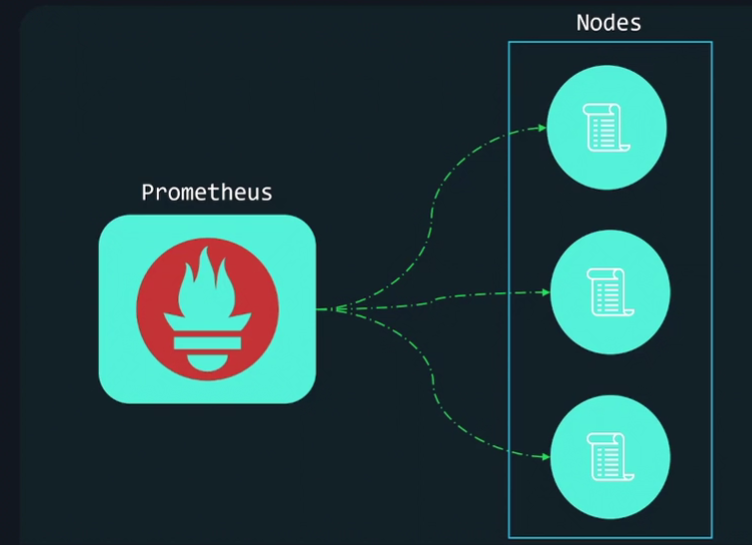
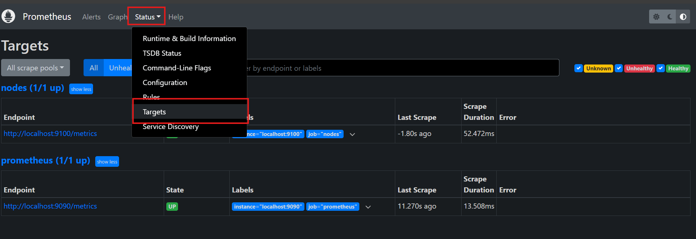
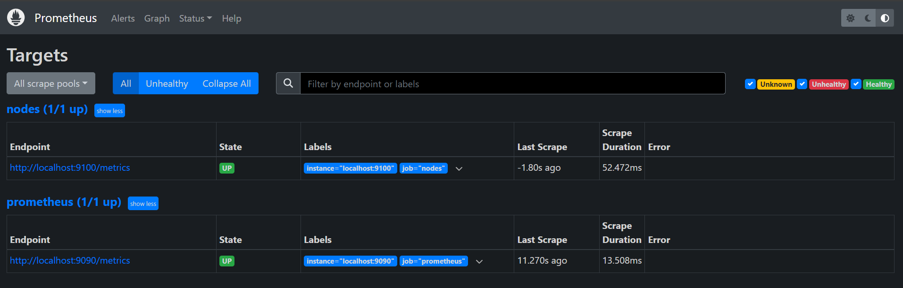

# Prometheus configuration

Let's configure prometheus to scrape the nodes we just set up.



## Configuration file

* Here the config file: `sudo vim /etc/prometheus/prometheus.yml`

```yaml
# Default parameter for all other config section
global:
  scrape_interval: 1m
  scrape_timeout: 10s

# Define targets and configs for metrics collection
scrape_configs:
  - job_name: "nodes" # A job consists of a collection of instances that need to be scraped
    # Configs for scrape job. Takes a precedence over global config
    scrape_interval: 30s
    scrape_timeout: 3s
    scheme: http
    metrics_path: /metrics
    # Set of targets to scrape
    static_configs:
      - targets: ["localhost:9100"]
```
* Restart prometheus service: `sudo systemctl restart prometheus.service`
* Check that your target is UP:
  
  1.Go to http://localhost:9090, and look for Status/Targets
  
  2. Make sure targets are **UP**
  

