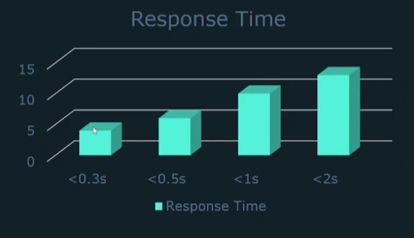
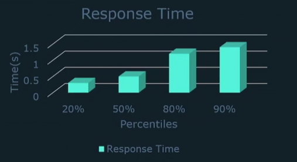

# Metrics

## Main metrics

Pattern of a metric:
```
<metric_name>[{<label_1="value_1",<label_N="value_N">>}] <metric_value>
```
Example:
```
node_cpu_seconds_total{cpu="0", mode="idle"} 258277.86
```

Every metrics has two attributes:

```
# HELP node_cpu_scaling_frequency_min_hertz Minimum scaled CPU thread frequency in hertz.
# TYPE node_cpu_scaling_frequency_min_hertz gauge
node_cpu_scaling_frequency_min_hertz{cpu="0"} 8e+08
node_cpu_scaling_frequency_min_hertz{cpu="1"} 8e+08
node_cpu_scaling_frequency_min_hertz{cpu="2"} 8e+08
node_cpu_scaling_frequency_min_hertz{cpu="3"} 8e+08
```

- HELP: descritpion of what the metric is
- TYPE: Specifies what type of metric (counter, gauge, histogram, summary)

4 main metrics:
- `counter`:
  - How many time did X happen
  - Number can only increase
  - Example: Total of request, Total of Exceptions ...
- `gauge`:
  - What is the current value of X
  - Can go increase or decrease
  - Example: CPU Utilization, Available Memory system ...
- `histogram`:
  - How long or how big something is
  - Groups observations into configurable bucket size
  - Example: Response time < 1s, Request size < 1500Mb, see the graph below
  

- `summary`
  - Similar to histograms
  - How many observations fell below X
  - Don't have to define quantiles ahead of time
  - Example: response time:
      - 20% = .3s
      - 50% = 0.8s
      - 80% = 1s
    
    

## Labels

- Key-value pairs associated with a metrics
- Allows you yo split up a metric by specified criteria (e.g. CPU number, hosname...)
- Metric can have more than one label
- ASCII leters, numbers, underscores

Multiple labels areavailable: 
* `requests_total{path=/auth, method=get}`
* `requests_total{path=/auth, method=post}`

* Metric name is just another label:
  `node_cpu_seconds_total{cpu=0}` = `{__name__=node_cpu_seconds_total,cpu=0}`

* Labels surrounded by `_` are considered internal to prometheus
* Every metric is assigned 2 labels default: **instance** and **job**
