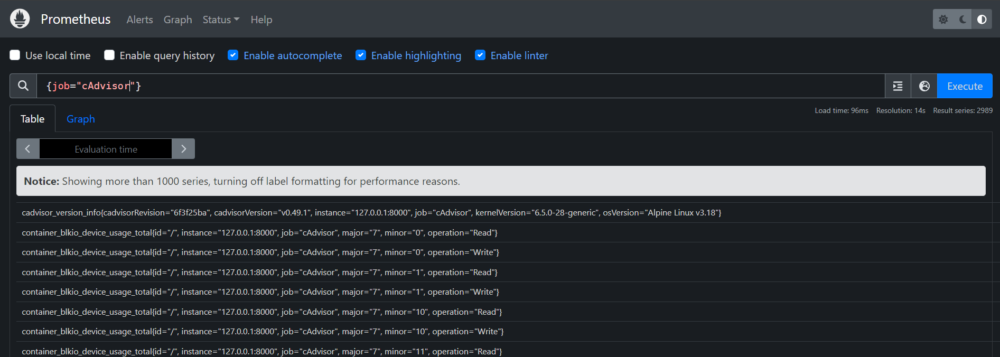

# Docker monitoring

## Docker Engine metrics

* Edit `/etc/docker/daemon.json` file:
  ```yaml
  {
          "metrics-addr": "127.0.0.1:9323",
          "experimental": true
  }
  ```

* Check the metrics using curl
  ```bash
  curl http://localhost:9323/metrics
  ```
  You shoud get 
  ```
  # HELP builder_builds_failed_total Number of failed image builds
  # TYPE builder_builds_failed_total counter
  builder_builds_failed_total{reason="build_canceled"} 0
  builder_builds_failed_total{reason="build_target_not_reachable_error"} 0
  builder_builds_failed_total{reason="command_not_supported_error"} 0
  builder_builds_failed_total{reason="dockerfile_empty_error"} 0
  builder_builds_failed_total{reason="dockerfile_syntax_error"} 0
  ...
  ```
* Add a new job on prometheus configuration:
  ```yaml
  scrape_config:
    - job_name: "docker"
      static_configs:
        - targets: ["127.0.0.1:9323"]
  ```

## cAdvisor metrics

* cAdvisor metrics: `vim docker-compose.yml`:
  ```yml
  version: 3.4
  services:
    cadvisor:
      image: gcr.io/cadvisor/cadvisor
      container_name: cadvisor
      priviledged: true
      devices:
        - "/dev/kmsg:/dev/kmsg"
      volumes:
        - /:/rootfs:ro
        - /var/run:/var/run:ro
        - /sys:/sys:ro
        - /var/lib/docker/:/var/lib/docker/:ro
        - /dev/disk/:/dev/disk:ro
      port:
        - 8000:8080
  ```

* Add cAdvisor to the prometheus configuration:
  ```yml
  scrape_configs:
    - job_name: "cAdvisor"
      static_configs:
        - targets: ["127.0.0.1:8000"]
  ```

## Difference between Docker metrics and cAdvisor

* Docker Engine:
  * How much CPU docker use
  * Total number of failed image build
  * Time to process container actions
  * No metrics specific to a container

* cAdvisor:
  * How much cpu/mem **each** container use
  * Number of processes running inside a container
  * Container uptime
  * Metrics on a per container basis

## Sort by job:

In the graph section of the Prom GUI type: `{job="<MY_JOB>"}`

  