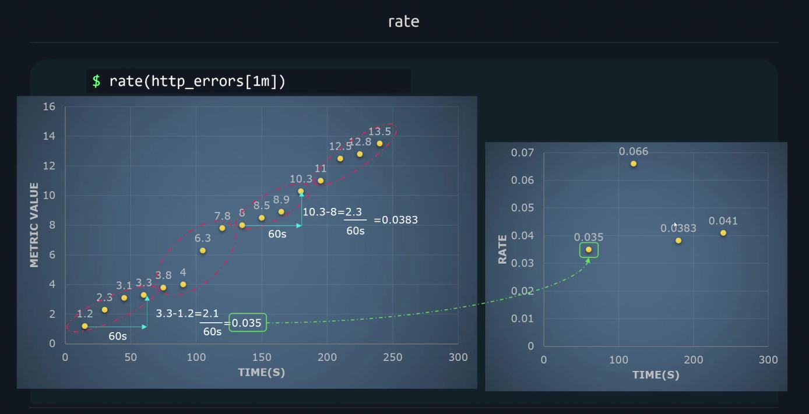
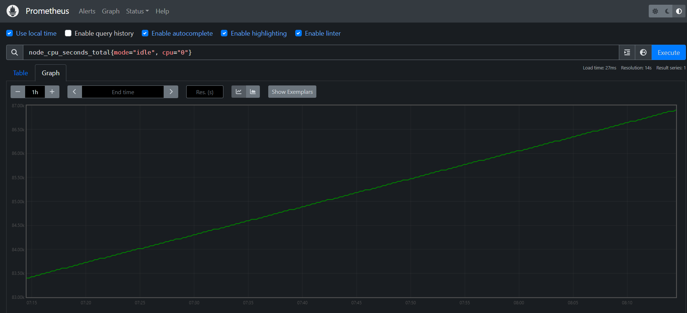
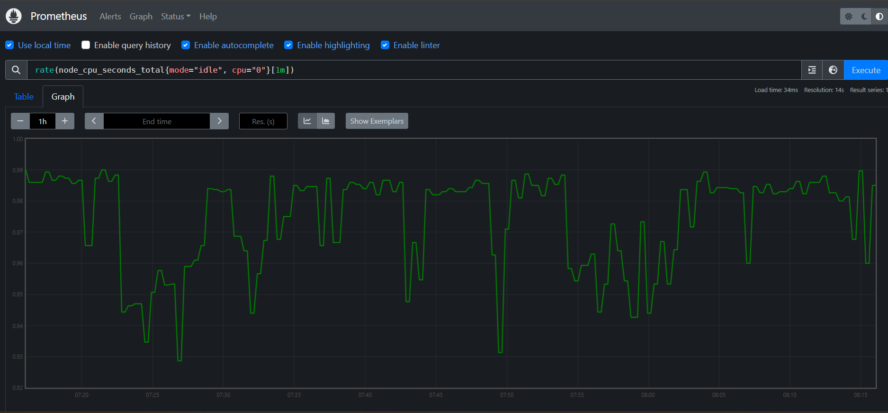
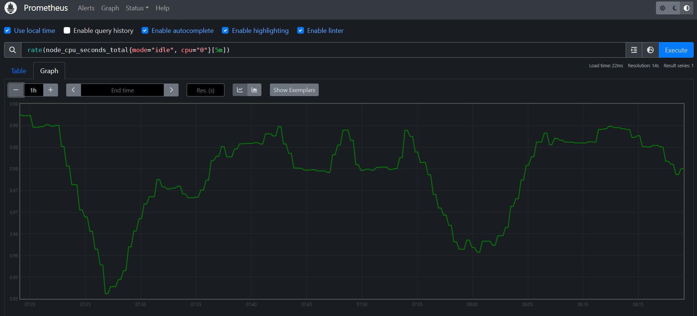
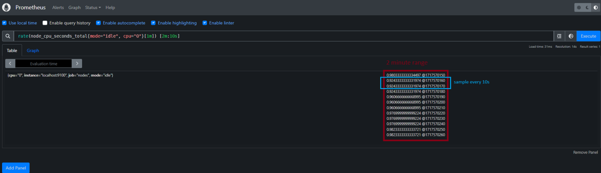
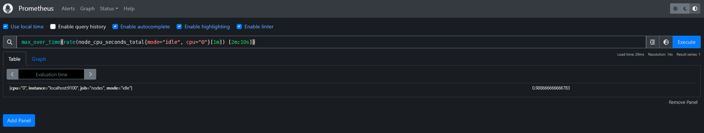

# PromQL

## What is promQL

* Short for Prometheus Query Language
* Main way to query metrics within Prometheus
* Data retruned can be visualized in dashboard
* Used to build alerting rules to notify administrators

## PromQL Data type

* String
* Scalar
* Instant vector
* Range vector

### String

A simple string: `Some random text`

### Scalar

A simple numeric floating point value: `72.542`

### Instant Vector

A set of time series containing a *single sample* for each time series

```
$ node_cpu_seconds_total

node_cpu_seconds_total{cpu="0", instance="server1"} 258277.86 March 3rd 11:05AM
node_cpu_seconds_total{cpu="1", instance="server1"} 735464.86 March 3rd 11:05AM

#-------Metric-------#----------Labels------------#--Value--#----Timestamp----#
#---------------Time series-----------------------#
```

* instant vector: `[value, timestamp]`


### Range Vector

A set of time series containing a *range* of data points over time for each time series

```
$ node_cpu_seconds_total[3m]

node_cpu_seconds_total{cpu="0", instance="server1"} 258277.86 March 3rd 11:05AM
                                                    486624.25 March 3rd 11:06AM
                                                    987522.14 March 3rd 11:07AM

node_cpu_seconds_total{cpu="1", instance="server1"} 492564.63 March 3rd 11:05AM
                                                    136549.37 March 3rd 11:06AM
                                                    963147.82 March 3rd 11:07AM
#-------Metric--------#----------Labels-----------#--Value--#----Timestamp----#
#---------------Time series-----------------------#
```


## Selector

### Matcher

* `=`: Exact match
  * `node_cpu_seconds_total{cpu="0"}`
* `!=`: Negative match
  * `node_filesystem_avail_bytes{device!="0"}`
* `=~`: Regexp match
  * `node_filesystem_avail_bytes{device=~"/dev/sda/.*"}`
* `!~`: Negative regexp match
  * `node_filesystem_avail_bytes{mountpoint!~"/boot.*"}`

* Multiple seclector:  `node_filesystem_avail_bytes{instance="node1", device!="tmpfs"}`

### Range vector selector

Same as before with a time range: `node_filesystem_avail_bytes{instance="node1", device!="tmpfs"}[2m]`

## Modifier

* Get metric at specific time: `node_cpu_seconds_total{mode="user"} @1717144005.542` 

* Offset modifier:
  Get historic of a value: `node_cpu_seconds_total{mode="user"}[1m] offset 5m`
  

* Combination: `node_cpu_seconds_total{mode="user"}[2m] @1717144005.542 offset 1h`

## Operator

### Arithmetic

| Operator | Description |
|---------|----------|
| **+** |  Addition|
|**-**|Substraction|
|**\***|Multiplication|
|**/**|Division|
|**%**|Modulo|
|**^**|Power|

Example: 

* `node_memory_Active_bytes{instance="localhost:9100", job="nodes"}  1901682688` : bytes
* `node_memory_Active_bytes{instance="localhost:9100", job="nodes"} /1024  1858600` : kilobytes

### Comparison

| Operator | Description |
|---------|----------|
| **==** |Equal|
| **!=** |Not equal|
|**>**|Greater than|
|**>=**|Greater or equal|
|**<**|Lower than|
|**<=**|Lower or equal|

Example:

* Query: `node_filesystem_avail_bytes`
  
  |Response| Value|
  |------|----|
  |node_filesystem_avail_bytes{device="/dev/sdc2", fstype="vfat", instance="localhost:9100", job="nodes", mountpoint="/boot/efi"}|530464768|
  |node_filesystem_avail_bytes{device="/dev/sdc3", fstype="ext4", instance="localhost:9100", job="nodes", mountpoint="/"} |374674792448|
  |node_filesystem_avail_bytes{device="/dev/sdc3", fstype="ext4", instance="localhost:9100", job="nodes", mountpoint="/var/snap/firefox/common/host-hunspell"}|374674792448
  |node_filesystem_avail_bytes{device="tmpfs", fstype="tmpfs", instance="localhost:9100", job="nodes", mountpoint="/run"}| 1667768320|
  |node_filesystem_avail_bytes{device="tmpfs", fstype="tmpfs", instance="localhost:9100", job="nodes", mountpoint="/run/lock"} |5238784|
  |node_filesystem_avail_bytes{device="tmpfs", fstype="tmpfs", instance="localhost:9100", job="nodes", mountpoint="/run/user/1000"}| 1669582848|

* Query: `node_filesystem_avail_bytes > 200000000000` (more than 200 Go)
  
  |Response| Value|
  |------|----|
  |node_filesystem_avail_bytes{device="/dev/sdc3", fstype="ext4", instance="localhost:9100", job="nodes", mountpoint="/"}|374674325504|
  |node_filesystem_avail_bytes{device="/dev/sdc3", fstype="ext4", instance="localhost:9100", job="nodes", mountpoint="/var/snap/firefox/common/host-hunspell"}|374674325504|

* Query: `node_filesystem_avail_bytes > bool 200000000000` (more than 200 Go, return 1 if true else 0)
  
  |Response| Value|
  |------|----|
  |node_filesystem_avail_bytes{device="/dev/sdc2", fstype="vfat", instance="localhost:9100", job="nodes", mountpoint="/boot/efi"}|0|
  |node_filesystem_avail_bytes{device="/dev/sdc3", fstype="ext4", instance="localhost:9100", job="nodes", mountpoint="/"} |1|
  |node_filesystem_avail_bytes{device="/dev/sdc3", fstype="ext4", instance="localhost:9100", job="nodes", mountpoint="/var/snap/firefox/common/host-hunspell"}|1|
  |node_filesystem_avail_bytes{device="tmpfs", fstype="tmpfs", instance="localhost:9100", job="nodes", mountpoint="/run"}| 0|
  |node_filesystem_avail_bytes{device="tmpfs", fstype="tmpfs", instance="localhost:9100", job="nodes", mountpoint="/run/lock"} |0|
  |node_filesystem_avail_bytes{device="tmpfs", fstype="tmpfs", instance="localhost:9100", job="nodes", mountpoint="/run/user/1000"}| 0|

*`bool` operator are mostly used for generating alerts*

### Logical Operator

* OR
* AND
* UNLESS

Example with `AND` operator, both requests are the same
* `node_filesystem_avail_bytes > 200000000 AND  node_filesystem_avail_bytes < 300000000000`
* `node_filesystem_avail_bytes > 200000000  < 300000000000`

## Vector matching

Operator between 2 instant vector

* Example: Free space disk left: 

`node_filesystem_avail_bytes / node_filesystem_size_bytes  * 100`:

|Vector| Value|
|---|---|
|{device="/dev/sdc2", fstype="vfat", instance="localhost:9100", job="nodes", mountpoint="/boot/efi"}|98.8|
|{device="/dev/sdc3", fstype="ext4", instance="localhost:9100", job="nodes", mountpoint="/"}|76.3|

* Example: Less than 85% of disk space is free
  `node_filesystem_free_bytes / node_filesystem_size_bytes * 100 < bool 85`
  |Response|Value|
  |---|---|
  |{device="/dev/sdc2", fstype="vfat", instance="localhost:9100", job="nodes", mountpoint="/boot/efi"}| 0|
  |{device="/dev/sdc3", fstype="ext4", instance="localhost:9100", job="nodes", mountpoint="/"}| 0 |
  |{device="/dev/sdc3", fstype="ext4", instance="localhost:9100", job="nodes", mountpoint="/var/snap/firefox/common/host-hunspell"}| 1 |
  |{device="tmpfs", fstype="tmpfs", instance="localhost:9100", job="nodes", mountpoint="/run"}|  0|
  |{device="tmpfs", fstype="tmpfs", instance="localhost:9100", job="nodes", mountpoint="/run/lock"}|  0|
  |{device="tmpfs", fstype="tmpfs", instance="localhost:9100", job="nodes", mountpoint="/run/user/1000"}|  0|

### Vector matching keyword

**Ignoring**
_______

By default when doing a vector matching, all labels **must** be the same.
* `node_filesystem_avail_bytes{device="/dev/sdc2"}` with `node_filesystem_size_bytes{device="/dev/sdc2"}`: MATCH
* `node_filesystem_avail_bytes{device="/dev/sdc2", mountpoint="/run"}` with `node_filesystem_size_bytes{device="/dev/sdc2"}`: NOT MATCH

Example: Assuming we want to get percentage of http request errors: 

```bash
$ http_errors

http_errors{method="get", code="500"}   40
http_errors{method="put", code="500"}   23
http_errors{method="post", code="500"}  60
```

```bash
$ http_request

http_request{method="get"}   421
http_request{method="del"}   288
http_request{method="post"}  372
```
Comparison won't work because of the `code` label which is present on `http_errors` but not on `http_request`. Using `ignore` allows us to force comparison

```bash
$ http_errors{code="500"} / ignoring(code) http_requests
{method="get"}  0.0950 # 40 / 421
{method="post"} 0.1612 # 60 / 372
```

The entries with methods `put` and `del` have no match and will not show up in the results

**on**
______
We can also use this query: `http_errors{code="500"} / on(method) http_requests`


### Many-to-one vector

Assuming we want to get percentage of http errors (no matter the error code)

```
$ http_errors_total

http_errors_total(error="400", instance="192.168.1.1", job="api", path="/cars")   13
http_errors_total(error="500", instance="192.168.1.1", job="api", path="/cars")   32
```

```
$ http_requests_total
http_requests_total(instance="192.168.1.1", job="api", path="/cars")    100
```

If we try to make a direct operation: 
```
http_errors_total / ignoring(error) http_requests_total
```
It won't work, because we are comparing 2 vector (errors) with one (total).

To do this we can use `group_left` (or `group_right` depending on the context)
```
http_errors_total / ignoring(error) group_left http_requests_total
```

## Agregation

|Aggregator|Descrition|
|----|-----|
|Sum|Calculate sum over dimensions|
|Min|Select minimum over dimensions|
|Max|Select maximum over dimensions|
|Avg|Average over dimensions|
|Group|All values in the resulting vector are 1|
|Stddev|Calculate population standard deviations over dimensions|
|Stdvar|Calculate population standard variance over dimensions|
|Count|Count number of elements in the vector|
|Count_values|Count number of elemetns with the same value|
|Bottomk|Smallest k elements by sample value|
|Topk|Largest k elements by sample value|
|Quantile|calculate n-quantile (0 < n < 1) over dimensions|

### Example

```
$ node_cpu_seconds_total{cpu="0"}

node_cpu_seconds_total{cpu="0", instance="localhost:9100", job="nodes", mode="idle"}    84303.51
node_cpu_seconds_total{cpu="0", instance="localhost:9100", job="nodes", mode="iowait"}  23.58
node_cpu_seconds_total{cpu="0", instance="localhost:9100", job="nodes", mode="irq"}     0
node_cpu_seconds_total{cpu="0", instance="localhost:9100", job="nodes", mode="nice"}    1.9
node_cpu_seconds_total{cpu="0", instance="localhost:9100", job="nodes", mode="softirq"} 2.12
node_cpu_seconds_total{cpu="0", instance="localhost:9100", job="nodes", mode="steal"}   0
node_cpu_seconds_total{cpu="0", instance="localhost:9100", job="nodes", mode="system"}  255.48
node_cpu_seconds_total{cpu="0", instance="localhost:9100", job="nodes", mode="user"}    701.15
```

```
$ sum(node_cpu_seconds_total{cpu="0"})

{}    85407.38
```

```
$ avg(node_cpu_seconds_total{cpu="0"})

{}    10679.653750000003
```

```
$ sum by(cpu) (node_cpu_seconds_total)

{cpu="0"}   85467.13999999998
{cpu="1"}   85468.37999999999
{cpu="2"}   85470.96
{cpu="3"}   85459.81999999999

```

```
$ sum without(cpu) (node_cpu_seconds_total)

{instance="localhost:9100", job="nodes", mode="idle"}      340199.79000000004
{instance="localhost:9100", job="nodes", mode="iowait"}    138.82
{instance="localhost:9100", job="nodes", mode="irq"}       0
{instance="localhost:9100", job="nodes", mode="nice"}      10.030000000000001
{instance="localhost:9100", job="nodes", mode="softirq"}   11.75
{instance="localhost:9100", job="nodes", mode="steal"}     0
{instance="localhost:9100", job="nodes", mode="system"}    1042.3899999999999
{instance="localhost:9100", job="nodes", mode="user"}      2854.86
```
## Function

* `sorting`
* `math`
* `label transformation`
* `metric manipulation`

### Math

```
$ node_cpu_seconds_total{mode="idle"}

node_cpu_seconds_total{cpu="0", instance="localhost:9100", job="nodes", mode="idle"}    85710.76
node_cpu_seconds_total{cpu="1", instance="localhost:9100", job="nodes", mode="idle"}    85704.41
node_cpu_seconds_total{cpu="2", instance="localhost:9100", job="nodes", mode="idle"}    85681.15
node_cpu_seconds_total{cpu="3", instance="localhost:9100", job="nodes", mode="idle"}    85683.71
```

#### Truncate value

* up:

```
$ ceil(node_cpu_seconds_total{mode="idle"})

node_cpu_seconds_total{cpu="0", instance="localhost:9100", job="nodes", mode="idle"}    85711
node_cpu_seconds_total{cpu="1", instance="localhost:9100", job="nodes", mode="idle"}    85705
node_cpu_seconds_total{cpu="2", instance="localhost:9100", job="nodes", mode="idle"}    85682
node_cpu_seconds_total{cpu="3", instance="localhost:9100", job="nodes", mode="idle"}    85684
```
* down:
```
$ floor(node_cpu_seconds_total{mode="idle"})

node_cpu_seconds_total{cpu="0", instance="localhost:9100", job="nodes", mode="idle"}    85710
node_cpu_seconds_total{cpu="1", instance="localhost:9100", job="nodes", mode="idle"}    85704
node_cpu_seconds_total{cpu="2", instance="localhost:9100", job="nodes", mode="idle"}    85681
node_cpu_seconds_total{cpu="3", instance="localhost:9100", job="nodes", mode="idle"}    85683
```

* absolute value:
```
$ abs(node_cpu_seconds_total{mode="idle"}*-1)

node_cpu_seconds_total{cpu="0", instance="localhost:9100", job="nodes", mode="idle"}    85710.76
node_cpu_seconds_total{cpu="1", instance="localhost:9100", job="nodes", mode="idle"}    85704.41
node_cpu_seconds_total{cpu="2", instance="localhost:9100", job="nodes", mode="idle"}    85681.15
node_cpu_seconds_total{cpu="3", instance="localhost:9100", job="nodes", mode="idle"}    85683.71
```

### Date and time
* `$ time()`
* `$ Minute()`
* `$ Hour()`
* ...

### Changing type

```
$ vector(4)
{}    4
```

```
$ scalar(process_start_time_seconds)

scalar  1652214822
```

### Sorting function

* `$ sort()`
* `$ sort_desc()`

### Rate



Calculate average rate: `rate(node_cpu_seconds_total{mode="idle", cpu="0"}[VALUE])`

With `VALUE` as value of sample: 
* if 1m: `(metric@[t0+60s] - metric@[t0]) / 60s`







### iRate

Same as rate but instead of make a difference between the last and the first value of the group, it substracts the last and the second last:


#### Difference between rate and irate

|Rate|iRate|
|--|--|
|Looks at the first and last data points within a range| Looks at the last two data points within a ranged|
|Effectively an average rate over the range| Instant rate |
|Best used for slow moving counter and alerting rules| Should be used for graphic volatile, fast-moving counters|


* Make sure there is **atleast 4 sample** within a given time range, ideally more
* When combining rate with an aggregation operator, always take **`rate()` first**, then aggregate:
  * `$ sum without(code, handler)(rate(http_requests_total[24h]))`

## Subqueries

This: `max_over_time(rate(http_requests_total[10m]))` won't work because `max_over_time` expects a range vector and this `rate(http_requests_total[10m])` provides an instant vector

Subqueries format: `<instant_query> [<range>:<resolution>] [offset <duration>]`

`$ rate(http_requests_total[1m]) [5m:30s]`
* `1m`: sample range
* `5m`: query range(get data from last 5 minutes)
* `30s`: query step for subquery

This retrun an instant vector : `max_over_time(rate(http_requests_total[1m]) [5m:30s])`

Which means: *Maximum rate of requests form the last 5 minutes with 30s query interval and a sample range of 1m*

### Range vector query



* last 2 minutes
* every 10 seconds



Get the maximum of the range vector

## Histogram

3 sub metrics:
* count: Total number of samples
* sum: Sum of all the samples
* bucket: Multiple buckets with a label `le` which contains all sample whose values are less than or equal to the value of the label

To get the total sum of latency accros all requests:
* `$ requests_latency_seconds_sum`

To get the rate of increase fo the sum of latency accross all requests:
* `$ rate(requests_latency_seconds_sum[1m])`

To calculate the average latency of a request over the past 5m
* `$ rate(requests_latency_seconds_sum[5m]) / rate(requests_latency_seconds_count[5m])`

To calculate the percentage of requests that fall into a specific bucket
* `$ rate(request_latency_seconds_bucket{path="/articles", le="0.06"}[1m]) / ignoring(le) rate(latency_seconds_count{path="/articles"}[1m])`

To calculate the number of observations between two buckets
* `$ request_latency_seconds_bucket{path="/articles", le="0.06"} - request_latency_seconds_bucket{path="/articles", le="0.03}`


### Quantiles

Determine how many values in a distribution are above or below a certain value

Quantiles represents percentiles

*90% quantile would mean at what value is 90 percent of the data less than*

Histogram have `histogram_quantile()` function to easily calculate quantiles values
* `$ histogram_quantile(<PERCENTILE>, <HISTOGRAM_METRIC>)`
* `$ histogram_quantile(0.75, request_latency_seconds_bucket)`

### Difference between Histogram and Summary

| Histogram | Summary |
|----------|---------|
| Bucket sizes can be picked | Quantile must be defined ahead of time |
| Less taxing on client libraries | More taxing on client librairies |
| Any quantile can be selected | Only quantiles predefined in client can be used |
| Promethesu server must calculate quantiles | Very minimal server-side cost |


