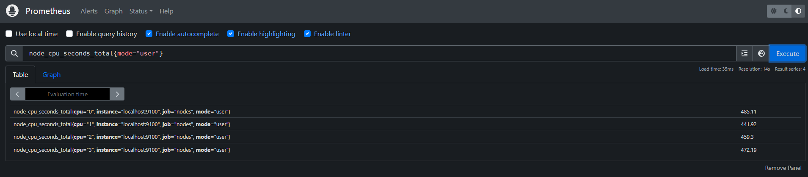
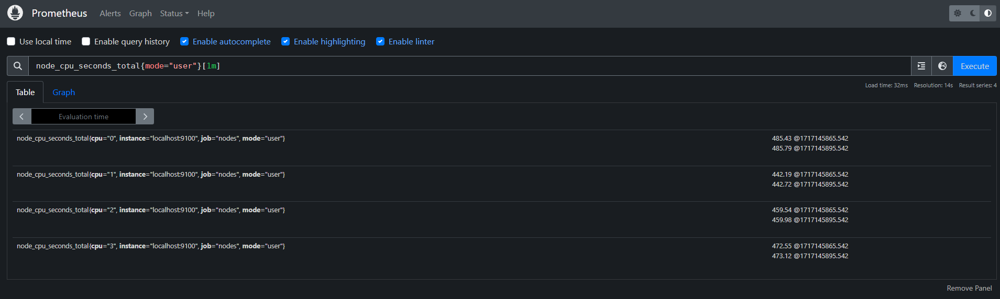
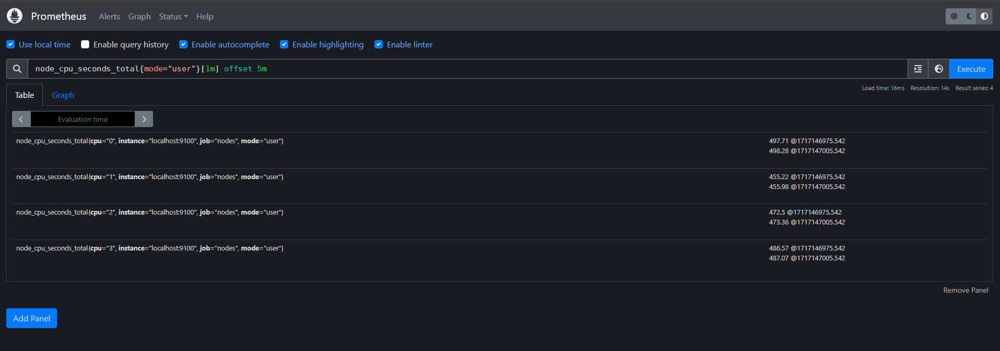

# PromQL

## What is promQL

* Short for Prometheus Query Language
* Main way to query metrics within Prometheus
* Data retruned can be visualized in dashboard
* Used to build alerting rules to notify administrators

## PromQL Data type

* String
* Scalar
* Instant vector
* Range vector

### String

A simple string: `Some random text`

### Scalar

A simple numeric floating point value: `72.542`

### Instant Vector

A set of time series containing a *single sample* for each time series

```
$ node_cpu_seconds_total

node_cpu_seconds_total{cpu="0", instance="server1"} 258277.86 March 3rd 11:05AM
node_cpu_seconds_total{cpu="1", instance="server1"} 735464.86 March 3rd 11:05AM

#-------Metric-------#----------Labels------------#--Value--#----Timestamp----#
#---------------Time series-----------------------#
```

* instant vector: `[value, timestamp]`



### Range Vector

A set of time series containing a *range* of data points over time for each time series

```
$ node_cpu_seconds_total[3m]

node_cpu_seconds_total{cpu="0", instance="server1"} 258277.86 March 3rd 11:05AM
                                                    486624.25 March 3rd 11:06AM
                                                    987522.14 March 3rd 11:07AM

node_cpu_seconds_total{cpu="1", instance="server1"} 492564.63 March 3rd 11:05AM
                                                    136549.37 March 3rd 11:06AM
                                                    963147.82 March 3rd 11:07AM
#-------Metric--------#----------Labels-----------#--Value--#----Timestamp----#
#---------------Time series-----------------------#
```



## Selector

### Matcher

* `=`: Exact match
  * `node_cpu_seconds_total{cpu="0"}`
* `!=`: Negative match
  * `node_filesystem_avail_bytes{device!="0"}`
* `=~`: Regexp match
  * `node_filesystem_avail_bytes{device=~"/dev/sda/.*"}`
* `!~`: Negative regexp match
  * `node_filesystem_avail_bytes{mountpoint!~"/boot.*"}`

* Multiple seclector:  `node_filesystem_avail_bytes{instance="node1", device!="tmpfs"}`

### Range vector selector

Same as before with a time range: `node_filesystem_avail_bytes{instance="node1", device!="tmpfs"}[2m]`

## Modifier

* Get metric at specific time: `node_cpu_seconds_total{mode="user"} @1717144005.542` 

* Offset modifier:
  Get historic of a value: `node_cpu_seconds_total{mode="user"}[1m] offset 5m`
  

* Combination: `node_cpu_seconds_total{mode="user"}[2m] @1717144005.542 offset 1h`