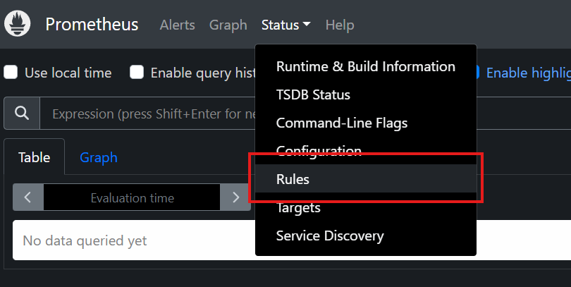
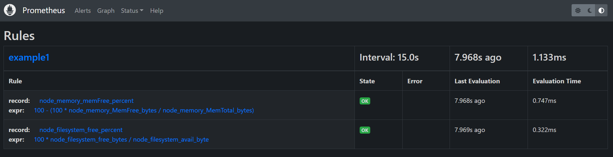

# Recording rules

Recording rules allow Prometheus to periodically evaluate PromQL expression and store the resulting times series generated by them

## Configuration

* In the prom config file: `vi /etc/prometheus/prometheus.yml`

```yaml
global:
  scrape_interval: 15s
  evaluation_interval: 15s

### RULE FILE CONFIG ###
rule_files:
  - "rules.yml"
  - "/etc/prometheus/rules/*.yml"
########################

scrape_configs:
  - job_name: "nodes"
    static_configs:
      - targets: ["localhost:9100"]
```

* When a rule is declared you have to restart prometheus

### File

```yaml
groups:
  - name: <group name 1>
    interval: <evaluation Interval>
    rules:
      - record: <rule name 1>
        expr: <promql expression 1>
        labels:
          <label name>: <label value>
      - record: <rule name 2>
        expr: <promql expression 2>
        labels:
  - name: <group name 2>
    rules:
```

* Each file defines one or more rule groups under the `group` key
* Evaluation interval - default to the global evaluation interval
* Each rule instructs Prometheus to evaluate the PromQL expression defined in `expr`
* The label field can optionally add or remove labels before storing the result
* Rules in a group will be evaluated **sequentially** in the order they are declared

### Example

* Percentage of free memory available on a node:
  `$ 100 - (100 * node_memory_MemFree_bytes/node_memory_MemTotal_bytes)`

* Percentage of free space available on filesystem:
  `$ 100 * node_filesystem_free_bytes/node_filesystem_avail_bytes`

This give us the following rule file:

```yaml
groups:
  - name: example1
    interval: 15s
    rules:
      - record: node_memory_memFree_percent
        expr:  100 - (100 * node_memory_MemFree_bytes/node_memory_MemTotal_bytes)
      
      - record: node_filesystem_free_percent
        expr: 100 * node_filesystem_free_bytes / node_filesystem_avail_bytes
```

* To check rules in the GUI go to 
  
  

* You can see your rules:

  

* We are also able to get these data from the search bar
  ```bash
  $ node_memory_memFree_percent
    node_memory_memFree_percent{instance="localhost:9100", job="nodes"}   80.94716031235104

  $ 100 * node_filesystem_free_bytes / node_filesystem_avail_bytes
    {device="/dev/sdc2", fstype="vfat", instance="localhost:9100", job="nodes", mountpoint="/boot/efi"}
    100
    {device="/dev/sdc3", fstype="ext4", instance="localhost:9100", job="nodes", mountpoint="/"}
    106.68411681596659
    {device="/dev/sdc3", fstype="ext4", instance="localhost:9100", job="nodes", mountpoint="/var/snap/firefox/common/host-hunspell"}
    106.68411681596659
    {device="tmpfs", fstype="tmpfs", instance="localhost:9100", job="nodes", mountpoint="/run"}
    100
    {device="tmpfs", fstype="tmpfs", instance="localhost:9100", job="nodes", mountpoint="/run/lock"}
    100
    {device="tmpfs", fstype="tmpfs", instance="localhost:9100", job="nodes", mountpoint="/run/snapd/ns"}
    100
    {device="tmpfs", fstype="tmpfs", instance="localhost:9100", job="nodes", mountpoint="/run/user/1000"}
    100
  ```

* If now you want to mak an average of a created rule you have to respect the sequence
  ```yaml
  groups:
  - name: example1
    interval: 15s
    rules:
      - record: node_memory_memFree_percent
        expr:  100 - (100 * node_memory_MemFree_bytes/node_memory_MemTotal_bytes)
      
      - record: node_filesystem_free_percent_avg
        expr: avg by(instance)(node_memory_memFree_percent)
  ```

## Best Practises

`level:metric_name:operation`

* `level`: indicates the aggregation level of the metric by the labels it has. This will always include the "job" label + any other relevant target labels
* `metric_name`: metric/time-series name
* `operations`: list of functions and aggregators that have been applied to the metric(i.e sum/max/avg)

Let's say we have a `http_errors` counter with two instrumetnation labels "method" and "path"
```yaml
- record: job_method_path:http_errors:rate5m
  expr: sum without(instance) (rate(http_errors{job="api" }[5m]))
```

Since both the method and path labels are used, the aggregation level is `job_method_path`

The metric name is `http_errors`

The operations that are performed is `rate` and `[5m]`

If we remove the `path` label:
```yaml
- record: job_method:http_errors:rate5m # metric_name is now http_method
  expr: sum without(instance, path) (rate(http_errors{job="api"}[5m]))
```

